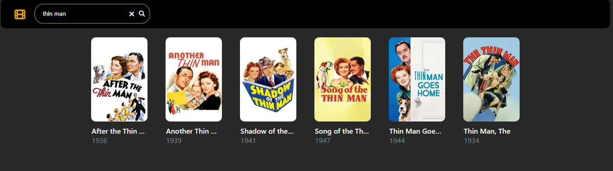

# ReelGen
Movie barcode generator. Scan the barcode with Fandango D2D app. $2 Movies!

**Fandango Disc to Digital Guide**

**Prerequisites:** Create a **Fandango** account.

**Step 1: Search for a movie or press enter.**  
Note: Disney owned properties: (20th Century Fox, Buena Vista) are not available.

**Step 2: Click on the movie poster you are interested in to generate a barcode.**

**Step 3: Open [Fandango's mobile web app](https://www.athome.fandango.com/disc) and use the disc to digital service to scan the UPC-A code.**  
Note: I use a computer or laptop for displaying the UPC-A code and a mobile phone to scan the UPC-A code.

| Open Fandango app | Enable Fandango permissions | Purchase movie |
|---|---|---|
|  |  |  |